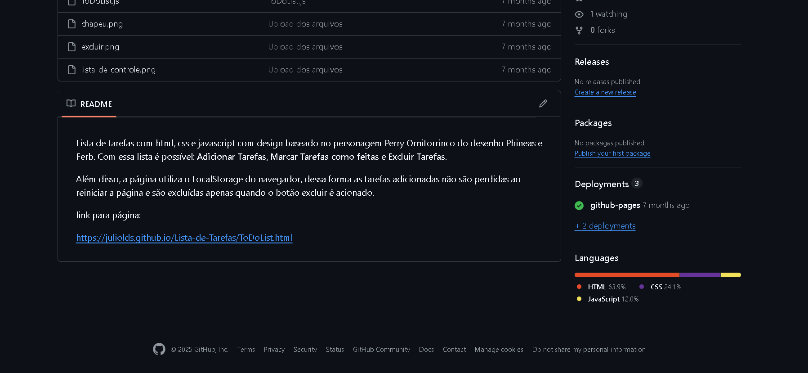
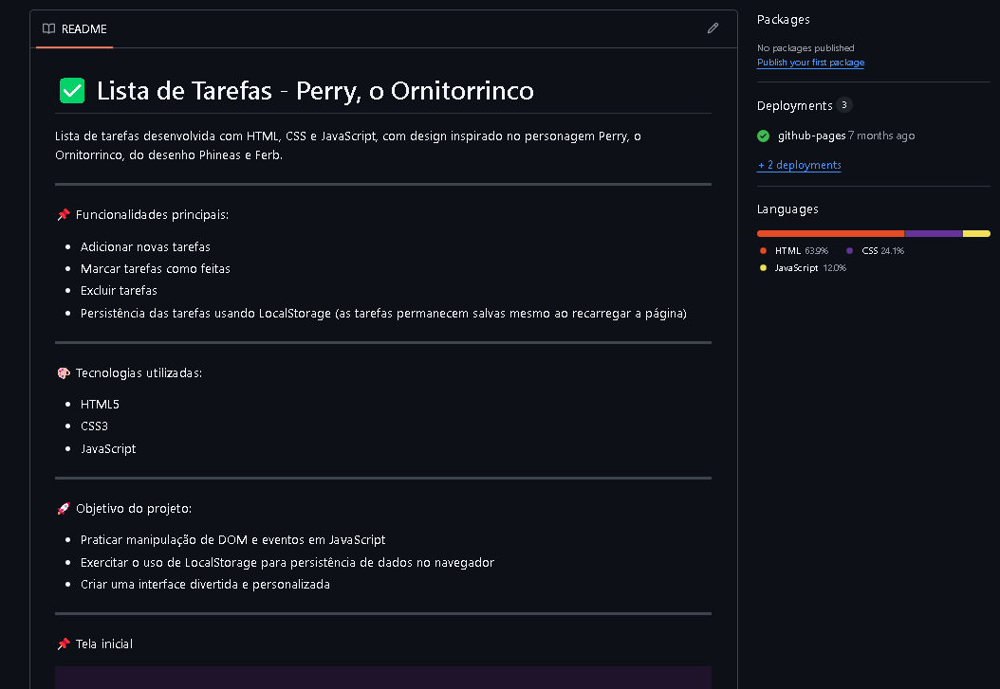
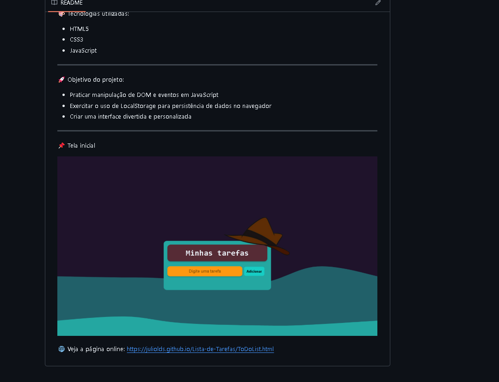

# 🤖 Agente de IA para Readmes Automáticos

Este projeto é um agente inteligente que automatiza a criação e atualização de arquivos README.md em projetos do GitHub. Ele gera títulos chamativos, textos descritivos personalizados de acordo com o contexto do projeto, insere ícones e até screenshots das telas, tornando a documentação mais atrativa e informativa — tudo de forma automática!

---

📌 **Funcionalidades principais:**
- Geração automática de README.md com textos elaborados por IA
- Inclusão de títulos, ícones e seções personalizadas
- Captura e inserção de screenshots reais das telas do projeto
- Atualização contínua do README conforme o projeto evolui
- Demonstração visual do impacto da IA: antes e depois da documentação

---

🎨 **Tecnologias utilizadas:**
- Python
- Playwright (para screenshots automáticos)
- OpenAI/GPT (para geração de textos)
- GitHub API

---

🚀 **Objetivo do projeto:**
- Automatizar a documentação de projetos de forma inteligente
- Valorizar a apresentação dos repositórios no GitHub
- Demonstrar o poder da IA aplicada ao desenvolvimento de software

---

**📌 Antes e Depois da Documentação**

Antes da IA:

Depois da IA:

